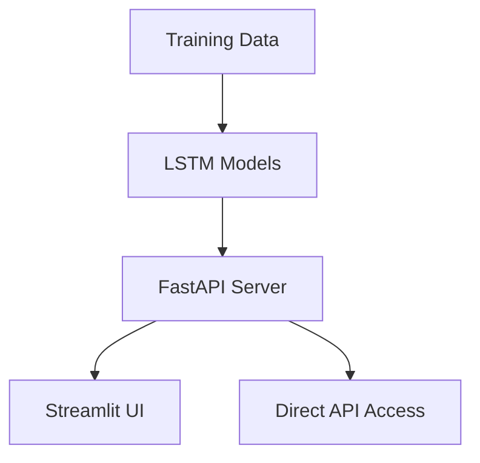

# 🔐 AI Password Generation System

A complete pipeline for generating secure passwords using LSTM neural networks, with a FastAPI backend and a Streamlit frontend.

---

## 🌟 Features

- **4 Password Types**: 
  - Capital letters (`ABCDE`)
  - Dictionary words (`alphabravo`)
  - Numeric (`12345`)
  - Special characters (`@!@!@`)
- **Smart Combination**: Dynamically mix character types for stronger passwords.
- **Temperature Control**: Adjust creativity/randomness in password generation.
- **API Access**: RESTful endpoints for seamless integration.
- **Web UI**: Intuitive Streamlit interface for real-time password generation.
- **Model Training**: Fully customizable training pipeline.

---

## 🛠️ System Architecture



---

## 🚀 Quick Start

### 1. Clone the Repository
```bash
git clone https://github.com/Jagdish1123/Password-Generator
```

### 2. Install Requirements
```bash
pip install -r requirements.txt
```

### 3. Train Models
```bash
python model.ipynb
```

### 4. Start FastAPI Server
```bash
uvicorn app:app --reload
```

### 5. Launch Streamlit UI
```bash
streamlit run streamlit_apy.py
```

---

## 📂 File Structure

```plaintext
password-generator/
├── model_artifacts/       # Saved models and vocabularies
├── app.py                 # FastAPI backend
├── model.ipynb            # Model training notebook
├── streamlit_apy.py       # Streamlit frontend
├── requirements.txt       # Python dependencies
└── README.md              # This document
```

---

## 🧠 Model Training

### Training Script (`model.ipynb`)
```python
# Sample training code (see full version in repo)
def train_models():
    passwords = {
        'Capital': ['ABCDE', 'BCDEF', ...],
        'Word': ['alpha', 'bravo', ...],
        'Numeric': ['12345', '23456', ...],
        'Special': ['@!@!@', '#$#$#', ...]
    }
    
    # Train and save models
    for ptype, samples in passwords.items():
        X, y, max_len, c2i, i2c = prepare_lstm_data(samples)
        model = train_lstm_model(X, y, len(c2i), max_len)
        model.save(f"model_artifacts/{ptype}_model.h5")
        # Save vocabularies...
```

### Saved Artifacts
Each model saves:
- `{type}_model.h5` - Trained Keras model
- `{type}_vocab.pkl` - Character mappings

---

## 🌐 FastAPI Server (`app.py`)

### Endpoints
| Endpoint       | Method | Description              |
|----------------|--------|--------------------------|
| `/`            | GET    | API documentation        |
| `/generate`    | GET    | Generate a password      |

### Example Request
```bash
curl "http://localhost:8000/generate?ptype=combined&length=12&temperature=0.7"
```

### Example Response
```json
{
  "password": "A3b@C5d#E7f!",
  "type": "combined",
  "length": 12,
  "entropy": 78.2
}
```

---

## 💻 Streamlit UI (`streamlit_apy.py`)

### Features
- Interactive parameter controls
- Real-time password generation
- Password strength meter
- Copy-to-clipboard functionality

---

## 🛠️ Customization

### Add a New Password Type
1. Add training data to the `passwords` dictionary in `model/ipynb`.
2. Retrain models:
   ```bash
   python model/ipynb --type new_type
   ```

### Adjust Model Parameters
Edit the `train_lstm_model()` function in `model/ipynb`:
```python
def train_lstm_model(X, y, vocab_size, max_len):
    model = Sequential([
        Embedding(vocab_size+1, 64, input_length=max_len),
        LSTM(256, return_sequences=True),
        LSTM(256),
        Dense(vocab_size+1, activation='softmax')
    ])
    # ...
```

---

## 🤝 Contributing

1. Fork the repository.
2. Create your feature branch:
   ```bash
   git checkout -b feature/YourFeature
   ```
3. Commit your changes:
   ```bash
   git commit -m "Add YourFeature"
   ```
4. Push to the branch:
   ```bash
   git push origin feature/YourFeature
   ```
5. Submit a pull request.

---

## 🏆 Pro Tip

For best results, use:
- **Temperature**: `0.7-1.2`
- **Length**: `12-16` characters

---

## 📖 This README Includes:

1. **System Overview** - Visual architecture and features
2. **Setup Instructions** - Step-by-step installation
3. **Code Samples** - Key implementation snippets
4. **API Documentation** - Endpoint specifications
5. **UI Screenshot** - Visual reference
6. **Customization Guide** - How to extend the system
7. **Best Practices** - Usage recommendations

---